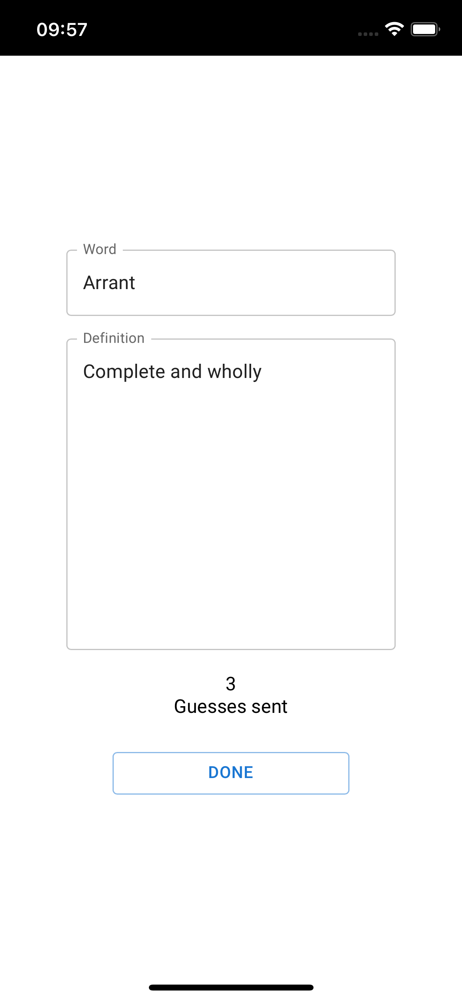

# Dictionarium PWA

**Note:** this repository contains only the frontend code for the web application. You can find the backend code and its url bellow:
- Server: https://dictionarium-app.herokuapp.com
- Server's code: https://github.com/arizabruno/dictionary_game_server

## Introduction 

### The original game

One of the players, lets call him/her the host, picks up a dictionary and chooses a non trivial word in which the other players will have to try to guess the definition. This player should write the correct definiton down in a piece of paper. 

Next, each of the other players will write down what they think the chosen word means as well as their names in a separate piece of paper and give them to the host.

The host will read out loud all of the guesses, without anouncning the writers's names, as well as the correct definition in a random order. 

The other players will vote on which of the definitions they think are the correct one. 

The host will be keep tracking of their votes. After all of the players have guessed the host will anounce the correct definition as well as the player's name behind each one of the guesses. Players who have written the correct definition, voted in the correct definition, or written a definition that was voted by toher players will receive points. If the correct definition was not voted by anyplayer the host should receive points. 

Player's will take turns to be the host.

There is no fixed pointing system but bellow is a suggestion for one:

| Description                                                                           | Points       | 
| :---                                                                                  |    :----:    | 
| A player has received a vote (not applicable to the host)                             | 5 per vote   |
| The correct definition was not voted by anyone (only applicable for the host)         | 10           |
| A player has guessed the correct definition (not applicable to the host)              | 20           |

 

### The application

The purpose of this application is purely to simplify the game by each palyer not having to write down their defintion in a piece of paper and instead use the app to send their definitions to the host.

The application could be further devloped to add an actual dicitionary in the app so the host could look up the word as well as to display all of the definitions anonymously to the other players in the devices and allow them to vote so the app could calculate the points automatically, **however** it is my belief that the game's essence lies in the interaction and dialogue between the players, thus this was not implemented.

 

## Demonstration

Bellow are screenshots of the application.

- Home screen:

- The player who will choose the word will create a room:

- The other players enter the room create:

- The host of the room will choose a word:

- The word will be instantly shown in the other players's screen so they can guess its definition:

- The host will read all of the guesses to the other players so they can vote:

## License

Code released under the [MIT License](LICENSE.md).

